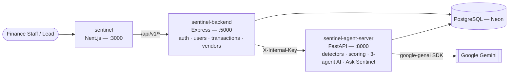
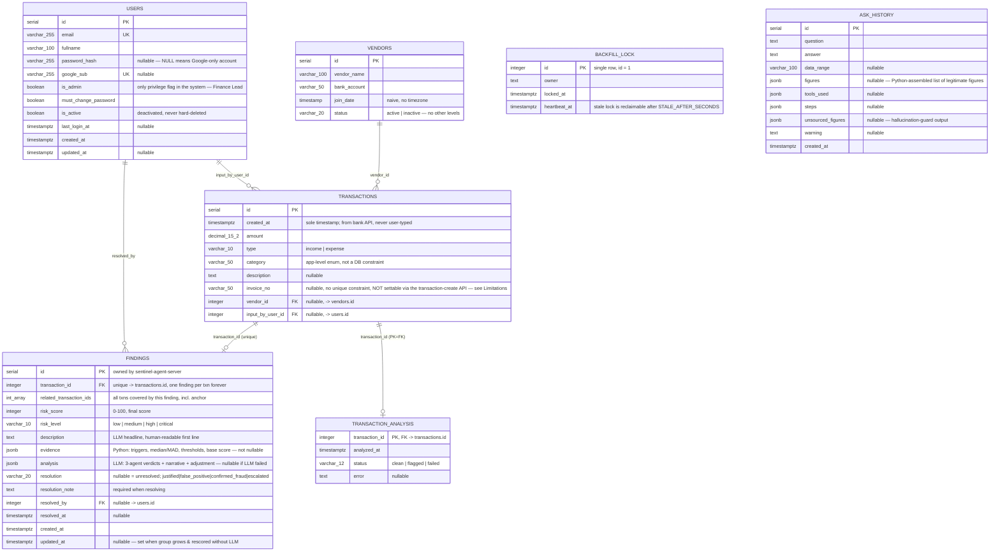

# Readme

# Sentinel — AI Financial Analyst

**Live demo:** [https://sentinel-sentry.vercel.app/](<https://sentinel-sentry.vercel.app/>)

Frontend : https://github.com/devinfebrian/sentinel
Backend : https://github.com/vhysxl/sentinel-backend
Agent-server: https://github.com/vhysxl/sentinel-agent-server

Account Admin: 
`Email : admin@sentinel.com`

`Password: Admin123!`

Sentinel is a proactive AI financial-audit platform. Deterministic Python detectors flag

anomalies in every transaction; a 3-agent Gemini pipeline investigates only the real

candidates and writes evidence-backed **Findings**; finance staff review/resolve them on a

dashboard or ask questions in plain language via **Ask Sentinel**.

---

## Architecture

Three services, one shared PostgreSQL database (Neon). Only `sentinel-backend` is

browser-facing; only it can reach `sentinel-agent-server` (shared-secret header, no other

auth — must stay network-private).



**Data ownership** (same DB, split by table): `sentinel-backend` owns `users`, `vendors`,

`transactions`. `sentinel-agent-server` owns `findings`, `transaction_analysis`,

`backfill_lock`, `ask_history`.

---

## Entity-Relationship Diagram



One shared Postgres DB — `findings`/`transaction_analysis`/`backfill_lock`/`ask_history` are

owned and written only by `sentinel-agent-server`; everything else by `sentinel-backend`.

---

## Tech Stack

| Service | Language | Framework | Data / Auth | AI |
| -- | -- | -- | -- | -- |
| `sentinel` | TypeScript | Next.js 16 (App Router), React 19, Tailwind v4, Zustand | JWT (localStorage) + optional Google Sign-In | — |
| `sentinel-backend` | Node.js | Express 4, Drizzle ORM | PostgreSQL (Neon), JWT + Google Sign-In | — |
| `sentinel-agent-server` | Python | FastAPI, SQLAlchemy | Same PostgreSQL; internal shared-secret only | Google Gemini (`google-genai` SDK) |

All three deploy on **Vercel**.

---

## Core Features

* **7 deterministic fraud detectors** (pure Python, no AI): amount anomaly (modified z-score

  vs. vendor/category baseline), duplicate invoice, split payment, smurfing, vendor risk

  (inactive/new), vendor backdated, off-hours timing.
* **Two-layer scoring**: base score from detector points (Python, capped at 80) + AI semantic

  adjustment (±20, one agent only) → final 0–100, mapped to Low / Medium / High / Critical.
* **3-agent AI investigation** (Gemini): Agent 1 (financial) + Agent 2 (fraud) investigate a

  candidate in parallel, Agent 3 verifies both and may nudge the score. The AI never computes

  or overrides a number — it only narrates and verifies.
* **Ask Sentinel** — natural-language Q&A over company data (plan → execute → narrate), with a

  post-answer figure-audit step that flags any number the model couldn't trace back to real

  query output.
* **Findings dashboard** — live analysis console, filter/search, resolve with a mandatory

  reason.
* **Transactions & vendors** — CRUD, vendor management, spreadsheet import UI (backend endpoint

  currently missing — see Limitations).
* **Admin** — user creation/deactivation (single `is_admin` flag; see Limitations).

---

## How to Run

All three services must run together — `sentinel` needs `sentinel-backend`, and

`sentinel-backend` needs `sentinel-agent-server`. `AGENT_SERVER_KEY` (backend) must exactly

match `INTERNAL_API_KEY` (agent server).

`sentinel-agent-server` (start first — owns the shared DB migrations)

```bash
python -m venv venv && source venv/bin/activate
pip install -r requirements.txt
cp .env.example .env        # set DATABASE_URL, INTERNAL_API_KEY, GEMINI_API_KEY
python migrate.py
uvicorn app.main:app --reload --port 8000
```

`sentinel-backend`

```bash
npm install
cp .env.example .env        # set DATABASE_URL, JWT_SECRET(s), AGENT_SERVER_URL/KEY
npm run db:migrate
npm run db:seed             # optional — creates the first Finance Lead account
npm run dev                 # http://localhost:5000
```

`sentinel` (frontend)

```bash
npm install
cp .env.example .env.local  # set BACKEND_URL (defaults to http://127.0.0.1:5000)
npm run dev                 # http://localhost:3000
```

Or just use the live deployment: [**https://sentinel-sentry.vercel.app/**](<https://sentinel-sentry.vercel.app/>)

---

## Limitations (~50% implementation status)

The detection algorithms genuinely work — all 7 detectors, the scoring engine, the 3-agent

pipeline, and Ask Sentinel all run correctly against real data. What's not production-ready is

the business infrastructure around them:

* Split-payment detection for the same invoice may not work if the system enforces a unique constraint on transactions table.
* **Bulk transaction import is currently broken end-to-end.** The frontend's import flow calls

  `POST /transactions/import`, which parses `invoice_no` from the spreadsheet — but that route

  doesn't exist on `sentinel-backend` (`transaction.routes.js` only has `POST /`, `GET /`,

  `GET /categories`, `GET /:id`, `PUT /:id`). Every import attempt fails.
* **The Rp25,000,000 split-payment threshold is fictional.** The app has no real

  budget/finance-threshold configuration anywhere — it's a hardcoded placeholder, not a

  company policy value.
* **No RBAC beyond a single** `is_admin` **flag**, and no tiered approval workflow — Finance Staff

  and Finance Lead have identical data access.
* **Auth enforcement is client-side only** — no Next.js `middleware.ts`; session lives in

  `localStorage`.
* **The agent server has no authentication of its own** beyond a shared-secret header —

  it must never be exposed directly to the internet.
